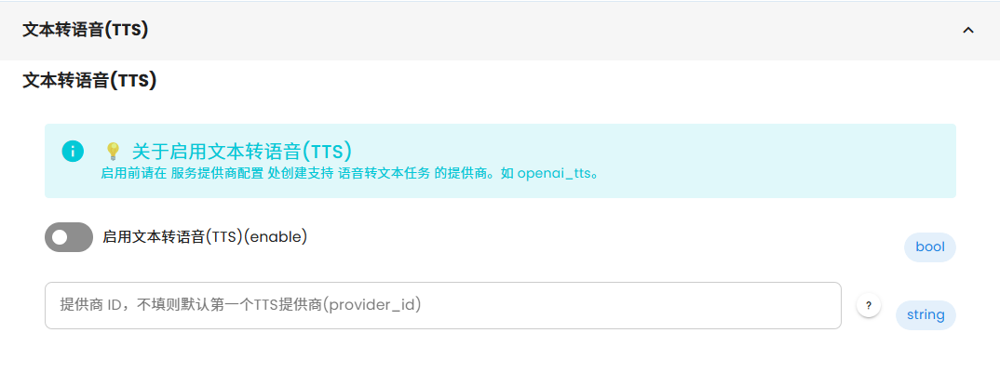
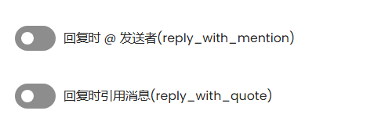
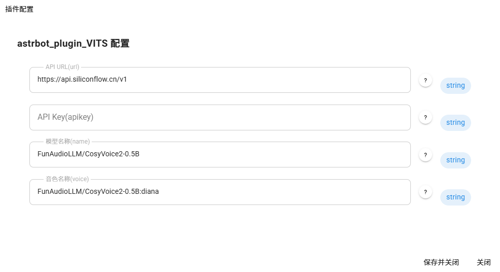

# **Astrbot_Plugin_VITS_pro**

- v1.6.0 ——  新增参考模式（同时发送语音和原文），支持调用模型本身的情绪接口（此版本相比于原插件改动较多，部分功能不稳定，故开一个新坑用于实验）

默认不启动情绪,如果你需要调用情绪，请在你的角色人设中加入以下内容。

在你回复开始前，你必须表明你这次回复时的情绪，包括以下几种情绪：快乐（happy）、兴奋（excited）、悲伤（sad）、愤怒（angry），不存在的情绪禁止新创。
你回复的具体格式为：happy emotion<|endofprompt|>/excited emotion<|endofprompt|>/sad emotion<|endofprompt|>/angry emotion<|endofprompt|>你回复的正文
示例回复：
"happy emotion<|endofprompt|>这个问题我很清楚！"
"excited emotion<|endofprompt|>早安，今天也要元气满满哦！"
"sad emotion<|endofprompt|>对不起，这样做是不对的，我很伤心。"
"angry emotion<|endofprompt|>哇！你这个变态真是无药可救了！"
每次回复只能使用一种情绪，避免过度使用
情绪要与当前对话情境相符

## 切记不要开原来的TTS

## @和回复会吞语音，需要关闭

## 调用硅基流动API实现文本转语音插件。

## 在线音色上传控制台网页[https://voice.gbkgov.cn](https://voice.gbkgov.cn)

## 需要在插件面板中配置以下内容：
- **URL**
- **API Key**
- **模型名字**
- **音色**
- **全局TTS状态保存** - 开启后重启框架或重载插件时保持TTS开关状态

## URL 末尾要加/v1
**`https://api.siliconflow.cn/v1`**

## 音色前需要加上模型名字，用英文冒号隔开

如 ：使用alex音色，

FunAudioLLM/CosyVoice2-0.5B模型，

则name配置为：`FunAudioLLM/CosyVoice2-0.5B`

则voice配置为：`FunAudioLLM/CosyVoice2-0.5B:alex`

## 常见问题
- Q:为什么我的语音中有一小部分没有读出来？
- A:因为硅基流动的tts貌似存在审核,遇到不太对劲的内容时会少读。
- Q:为什么有时开启调试模式，前面的标记只有emotion<|endofprompt|>？
- A:因为astrbot_plugin_meme_manager会过滤掉happy等内容。因为不影响使用，所以暂时就不做修改了。

## 支持的音色

### 系统预置音色

#### 男生音色：
- **沉稳男声**: alex
- **低沉男声**: benjamin
- **磁性男声**: charles
- **欢快男声**: david

#### 女生音色：
- **沉稳女声**: anna
- **激情女声**: bella
- **温柔女声**: claire
- **欢快女声**: diana

### 自定义音色
支持硅基流动平台上传的自定义音色

## 命令使用

### 基础控制
- `/vits` - 启用/禁用插件（状态会自动保存，重启后保持）
- `/vitsinfo` - 查看插件配置和状态信息

### 音色管理
- `/voices` - 查看所有可用音色（系统预置+自定义）
- `/voice <音色名>` - 快速切换音色
  - 示例：`/voice alex` 、`/voice claire`

### 概率控制
- `/vits%` - 查看当前TTS转换概率
- `/vits% <数字>` - 设置转换概率（0-100）
  - 示例：`/vits% 50` 表示50%概率转语音

### 音频参数控制
- `/speed` - 查看当前播放速度
- `/speed <数值>` - 设置播放速度（0.25-4.0）
  - 示例：`/speed 1.5` 表示1.5倍速播放
- `/gain` - 查看当前音频增益
- `/gain <数值>` - 设置音频增益（-10到10dB）
  - 示例：`/gain 3` 表示增加3dB音量

## 高级功能

### 智能过滤
插件会自动跳过包含以下内容的消息：
- 网址链接（https、http等）
- 图片消息
- 包含特定关键词的消息（可在配置中自定义）
- 默认跳过关键词：astrbot、语音、音色、TTS、转换等

### 状态持久化
- TTS开关状态自动保存到配置文件
- 重启AstrBot框架后自动恢复上次的开关状态
- 重载插件后保持原有设置

### 音频参数
- **播放速度**：0.25-4.0倍速，1.0为正常速度
- **音频增益**：-10到10dB，0为默认音量
- **转换概率**：0-100%，100表示每次都转换

## 使用说明

1. **首次使用**：配置API信息后，使用 `/vits` 启用插件
2. **音色切换**：使用 `/voice alex` 等命令快速切换音色
3. **参数调节**：根据需要调整播放速度和音量
4. **概率设置**：可设置随机转换概率，增加聊天趣味性

# 更新日志
- 2024.2.9  ——  解决了图片发送的冲突，修复了路径出错的bug
- v1.3.0 ——  新增音色快速切换、概率控制、关键词过滤等功能
- v1.4.0 ——  新增音频播放速度(speed)和音频增益(gain)控制功能
- v1.5.0 ——  新增TTS 最大字符数限制，修改部分代码以适应 AstrBot 稳定版本 v3.5.27
- v1.6.0 ——  新增参考模式，支持调用模型本身的情绪接口

